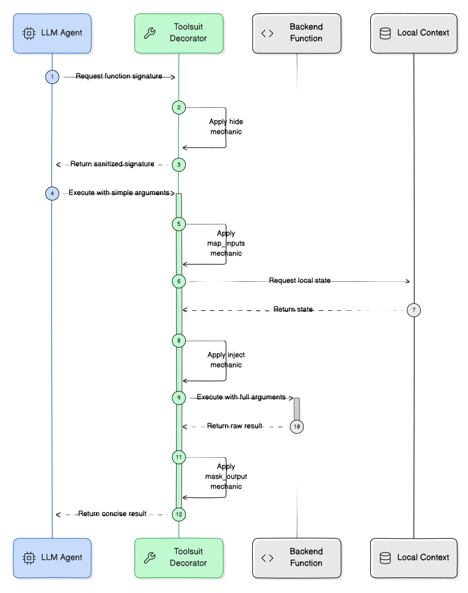

# toolsuit

[](https://pypi.org/project/toolsuit/)
[](https://github.com/sinsniwal/toolsuit/actions/workflows/test.yml)
[](https://opensource.org/licenses/MIT)

**A zero-dependency Python decorator that hides internal arguments from LLM tool schemas by modifying native function signatures.**

<p align="center">
  
</p>

---

Stop writing dummy wrapper functions just to hide backend state from your AI agents.

If you have a backend function like `fetch_user(user_id, db_session)` and pass it to an LLM router (OpenAI, Anthropic, LangChain), the SDK reads the function's signature and puts `db_session` into the JSON schema. The LLM will then try to hallucinate a database connection.

**toolsuit** fixes this at the interpreter level.

It is a zero-dependency decorator that mutates your function's `__signature__` at import-time using four core mechanics:

1. **`hide`**: Strips internal arguments from the exposed signature. The LLM only sees `fetch_user(user_id)`.
2. **`inject`**: Securely passes your local state at runtime. The backend executes `fetch_user(user_id, db_session=local_db)`.
3. **`map_inputs`**: Translates simple AI strings (e.g., "Alice") into your internal identifiers (e.g., "u_123") before execution.
4. **`mask_output`**: Filters massive backend return payloads into concise summaries to save tokens and prevent context bloat.

You get clean context windows and zero leaked secrets, without changing your core business logic or adding heavy framework dependencies.

## Installation
```bash
pip install toolsuit
```

## The Proof

Here is exactly how the 4 mechanics work together to secure a database query.

```python
from typing import Any
from toolsuit import equip
import inspect

# 1. Local State (Never exposed to the LLM)
def get_db() -> dict:
    return {"u_123": {"name": "Alice", "role": "admin", "hash": "xyz789"}}

# 2. Implementation
@equip(
    hide=["db_session"],
    inject={"db_session": get_db},
    map_inputs={"user_id": lambda name: {"Alice": "u_123"}.get(name, name)},
    mask_output=lambda res: f"Success: {res['name']} is {res['role']}." if res else "Not found."
)
def fetch_user(user_id: str, db_session: Any) -> dict:
    return db_session.get(user_id, {})

# --- WHAT THE LLM SEES ---
print(inspect.signature(fetch_user))
# Output: (user_id: str) -> dict
# Notice: db_session is completely hidden from the AI's schema builder.

# --- WHAT ACTUALLY EXECUTES ---
print(fetch_user(user_id="Alice"))
# Output: 'Success: Alice is admin.'
# Notice: Executed locally using 'u_123', the injected DB, and masked the password hash.
```

## Type Safety & IDEs
Because `toolsuit` dynamically modifies the signature at runtime, static type checkers (`mypy`, `pyright`) and IDEs will still see the original, full function signature. This allows you to test your functions locally with all arguments while keeping the LLM blind to them in production.

## Compatibility
Works out-of-the-box with any framework utilizing the Python `inspect` module to build JSON schemas:
* OpenAI SDK
* Anthropic SDK
* LangChain / LangGraph
* LlamaIndex
* Pydantic (v1 and v2)

## Roadmap
* [x] **v0.1.x**: Synchronous functions, state injection, input mapping, and output masking.
* [ ] **v0.2.x**: Native `async def` support.
* [ ] **v0.3.x**: Class method (`self` and `cls`) context injection.

## License
MIT
